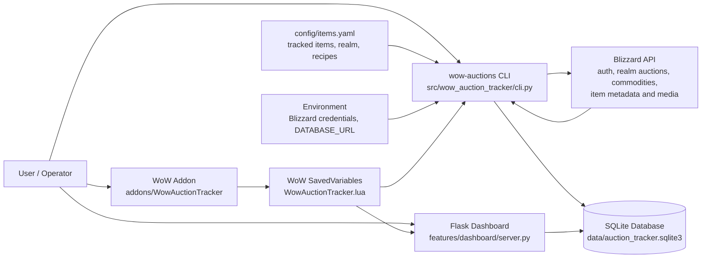
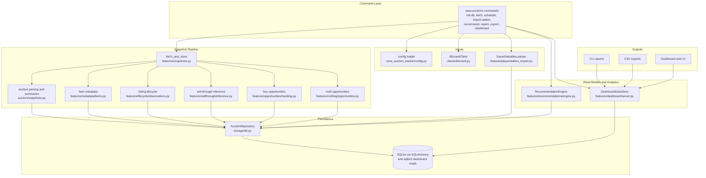
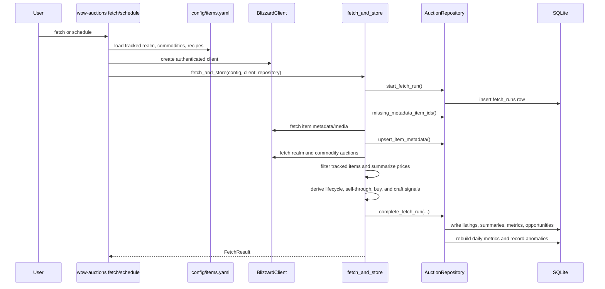
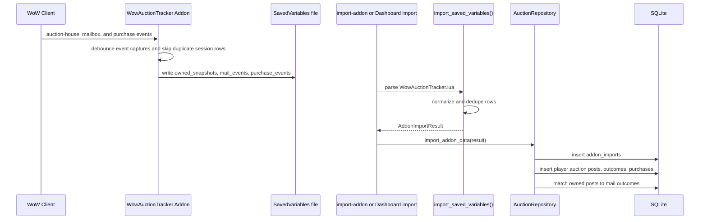
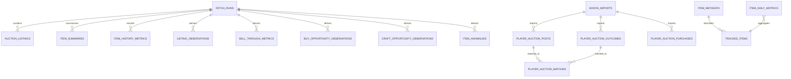

# Architecture

This project is a local auction analytics application. It collects World of
Warcraft auction-house snapshots from Blizzard APIs, imports personal auction
activity from the companion addon, stores everything in SQLite, and exposes the
results through CLI reports, CSV exports, and a Flask dashboard.

## System Context

## Runtime Components

## Snapshot Fetch Flow

## Addon Import Flow

## Stored Data Groups

## Key Design Notes

- The CLI is the orchestration boundary. It wires configuration, credentials,
  database setup, fetch/import commands, reports, exports, and dashboard startup.
- `AuctionRepository` is the write-side persistence boundary for snapshot and
  addon import data. The dashboard uses direct SQLite reads through
  `DashboardDataStore` for read-optimized overview payloads.
- Snapshot-derived demand is inferred from listing disappearance between fetch
  runs, so sell-through metrics are estimates rather than confirmed sales.
- The addon remains a minimal SavedVariables recorder. It captures player-owned
  auction activity in-game and leaves matching, dedupe across imports, and
  profit/loss calculations to the Python application.
